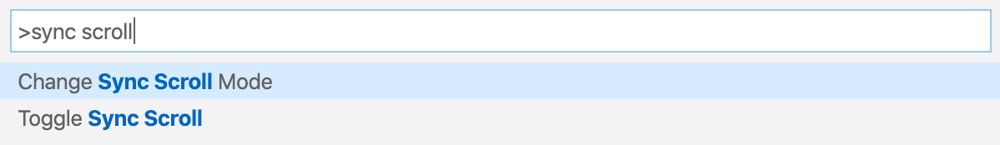
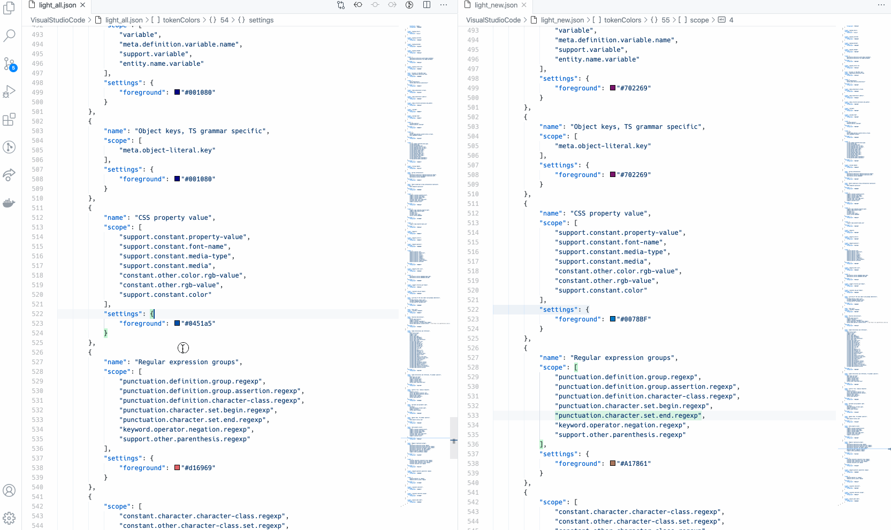
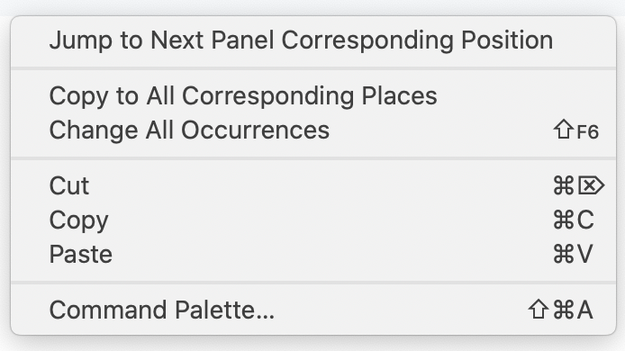

# Sync Scroll

A Visual Studio Code Extension that make split panels scroll synchronically.

## Features

This extension support synchronizing scrolling between split panels. You can choose your sync mode to make them scrolled together.

There're also commands you can use conveniently.

Also it will automatically highlight the corresponding selections when you focus the cursor on the one side.

Here are two commands you can find in the right-click menu in the content window.

- `Jump to Next Panel Corresponding Position` for navigating around the panels and in the corresponding position. It's very convenient to quick focus on the other side.
- `Copy to All Corresponding Places` for replacing all the text at corresponding positions from the selections. For example, it's for the case that you want to use the selected text on the left side also on the right side.

## Extension Settings

I've added some settings for this extension to define the behavior of the 2 states: enabled by default and scroll mode.

- By default, the extension is disabled, it will look in the user settings if enabled but WILL reset to this state every time you restart VSCode.
- Whereas scroll mode is set to normal by default, it will look in the user settings if changed but WILL NOT reset and save your choice between sessions.

For me, it's way more convenient to decide when to enable it (because we do not always compare code side by side) but keep scroll mode anyway. (Also reported in #25)

### I forked this repository because I needed to bring some features. As I linted all the files and did my own drastic changes, I didn't planned to create a PR to not mess with the original project. Thanks dqisme for this extension!
